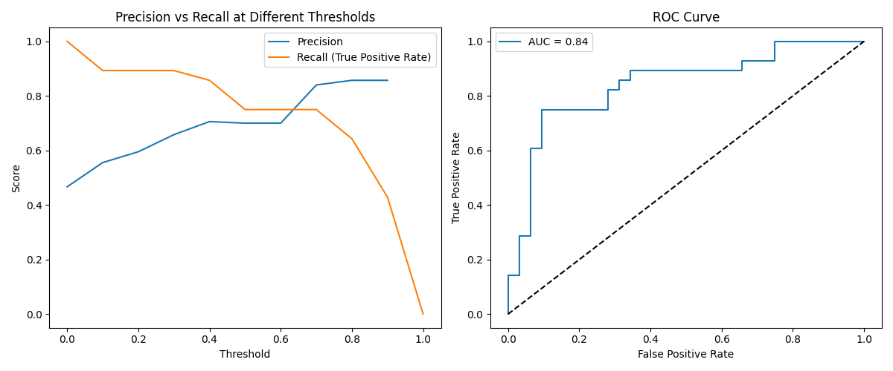
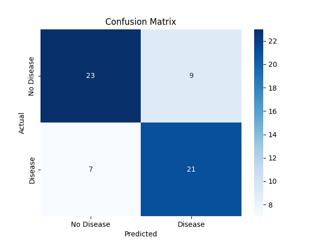
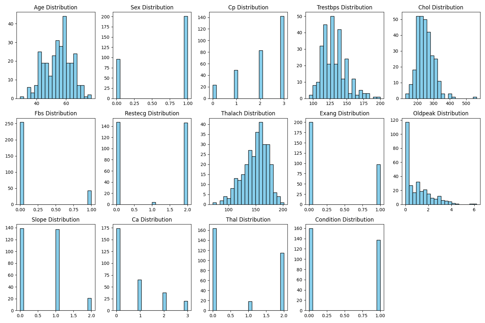

# 🫀 heart-disease-logreg

A Logistic Regression Classifier for Predicting Heart Disease Risk using the UCI Cleveland Heart Disease Dataset.

---

## 📌 Overview

This project builds a **logistic regression model** to predict whether a patient is likely to have heart disease, based on various clinical and demographic attributes. It uses the **Cleveland subset** of the UCI Heart Disease dataset, a widely studied benchmark in medical machine learning.

The goal is to demonstrate how a simple, interpretable model like logistic regression can be used effectively for **binary classification in healthcare**, and to analyze its performance using standard diagnostic plots.

---

## 📊 Dataset Summary

* **Source**: [UCI Machine Learning Repository](https://archive.ics.uci.edu/ml/datasets/heart+Disease)
* **Number of samples**: 303
* **Target variable**: Presence (1) or absence (0) of heart disease
* **Number of features**: 13 clinical attributes (e.g., age, cholesterol, resting ECG results)

---

## 📈 Model Summary

* **Algorithm**: Logistic Regression (scikit-learn)
* **Preprocessing**: Feature scaling, handling of categorical features
* **Evaluation**: 80/20 train/test split with stratification

---

## 🖼️ Results & Visualizations

### 🔹 ROC Curve

The **Receiver Operating Characteristic (ROC)** curve plots the trade-off between **True Positive Rate (Sensitivity)** and **False Positive Rate**. The **AUC (Area Under the Curve)** for this model is **0.84**, indicating high discriminative ability.

---

### 🔹 Precision-Recall Curve

This curve is particularly useful for imbalanced datasets. Our model maintains **high precision and recall**, suggesting it's well-calibrated for identifying positive (diseased) cases.

---

### 🔹 Confusion Matrix

The confusion matrix shows how the model performed on the test set:

* **True Positives**: Correctly predicted disease
* **True Negatives**: Correctly predicted absence of disease
* **False Positives**: Healthy misclassified as diseased
* **False Negatives**: Disease cases missed

These numbers help assess model **reliability in clinical contexts**, where false negatives can be critical.

---

### 🔹 Feature Histogram

These histograms show the distribution of key features like `age`, `cholesterol`, and `thalach` (maximum heart rate) for patients with and without heart disease. This helps reveal **which features are most separable** and potentially useful for prediction.

---

## ✅ Performance Metrics

| Metric               | Value |
| -------------------- | ----- |
| Accuracy             | 0.73  |
| Precision            | 0.77  |
| Recall (Sensitivity) | 0.72  |
| F1 Score             | 0.74  |
| ROC AUC              | 0.84  |

These metrics suggest the model is **balanced and effective** at detecting heart disease with low error.

---

## 💡 Why Logistic Regression?

Logistic regression is:

* **Simple and interpretable** (important for medical decision-making)
* **Fast to train**
* **Robust on small datasets**
* Produces **probability estimates**, which are helpful for risk assessment

Though more complex models may yield marginally higher accuracy, logistic regression provides **explainable baseline performance** that's crucial in healthcare applications.

---
## 📌 Future Work

* Compare with more complex models: Random Forest, XGBoost, Neural Nets
* Add SHAP or LIME for interpretability
* Deploy a web interface for public use
* Perform cross-validation and hyperparameter tuning

---

## 📄 License

This project is licensed under the MIT License.

---

Let me know if you’d like help generating the images (e.g., plotting code for ROC, PR curve, etc.) or turning this into a Jupyter Notebook format as well.
